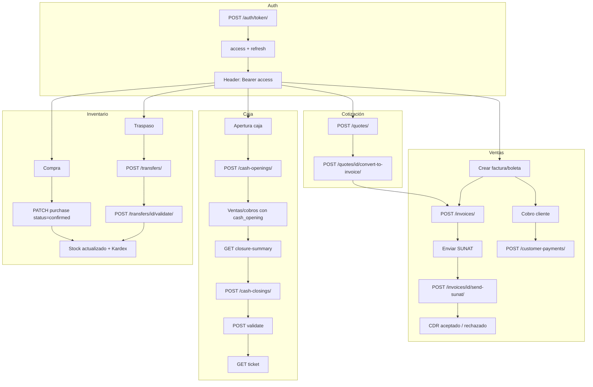
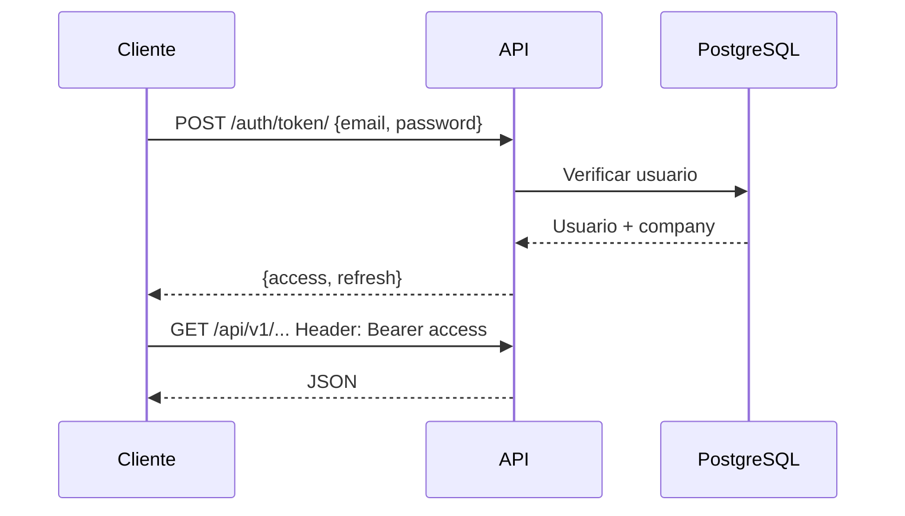
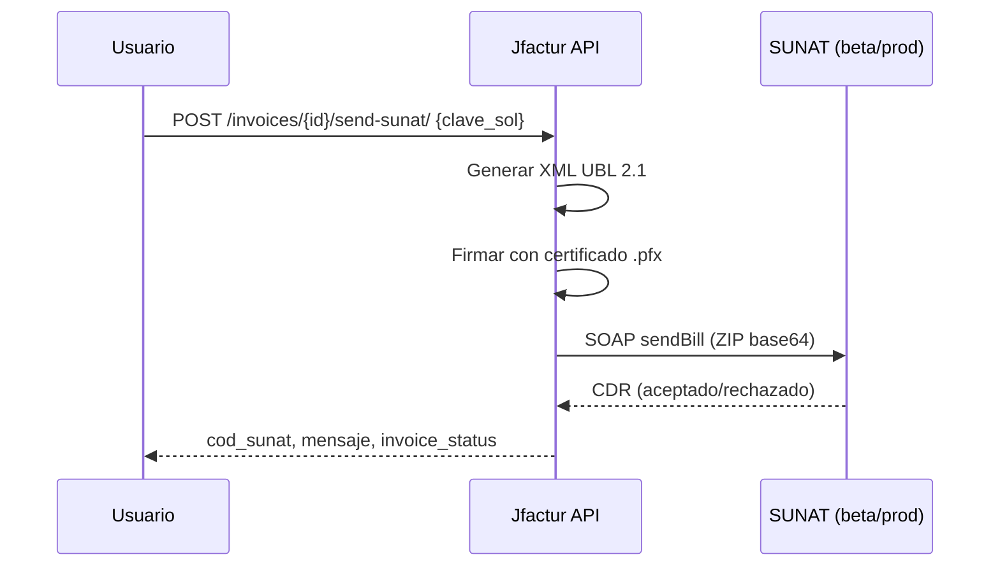

# Jfactur

Sistema de facturación electrónica (SUNAT), ventas, inventario, caja, compras y reportes. API REST con Django + JWT.

Repositorio: [https://github.com/Rudeus000/Jfactur](https://github.com/Rudeus000/Jfactur)

---

## ¿Qué tiene el sistema?

| Módulo | Descripción |
|--------|-------------|
| **Core** | Empresas, usuarios, autenticación JWT, consulta DNI |
| **Catálogo** | Clientes, proveedores, categorías, productos |
| **Inventario** | Almacenes, stock por producto/almacén, movimientos (kardex), traspasos entre almacenes |
| **Contabilidad** | Monedas, cuentas, bancos, cajas, aperturas/cierres de caja, gastos, balance |
| **Compras** | Órdenes de compra, pagos a proveedores; al confirmar compra se actualiza stock |
| **Facturación** | Series, facturas/boletas, cotizaciones, cobros; envío a SUNAT, ticket HTML; cotización → factura |
| **Reportes** | Libro de ventas, ventas por cliente/producto, aged receivable/payable, dashboard |

---

## Requisitos

- **Python 3.10+**
- **PostgreSQL** (base de datos `Sistema Jfactur`)

---

## Instrucciones de instalación

```bash
# 1. Clonar
git clone https://github.com/Rudeus000/Jfactur.git
cd Jfactur/backend

# 2. Entorno virtual e dependencias
python -m venv venv
venv\Scripts\Activate.ps1    # Windows
# source venv/bin/activate    # Linux/Mac
pip install -r requirements.txt

# 3. Variables de entorno
copy .env.example .env
# Editar .env: DB_PASSWORD, SECRET_KEY (y opcional SUNAT, DNI_LOOKUP_API_URL)

# 4. Migraciones
python manage.py migrate

# 5. Datos de prueba (opcional)
python manage.py load_sample_data
# Usuario: rudeus@jfactur.local / rudeus123

# 6. Ejecutar
python manage.py runserver
```

Los pasos 4 a 6 se ejecutan desde la carpeta `backend` (quedas en ella tras el paso 1). Si más adelante abres otra terminal en la raíz del repo, entra antes con `cd backend`.

**URL base:** http://localhost:8000  
**API:** http://localhost:8000/api/v1/

**Guía de uso:** Ver [docs/CASOS_DE_USO.md](docs/CASOS_DE_USO.md) para orden de configuración, qué hacer antes de cada cosa (facturar, cobrar, abrir caja, compras, traspasos, etc.) y casos de uso por módulo.

---

## APIs para seguir desarrollando

Todas las rutas están bajo `/api/v1/`. Autenticación: **Bearer Token** (JWT) en header `Authorization`.

### Autenticación

| Método | URL | Descripción |
|--------|-----|-------------|
| POST | `/api/v1/auth/token/` | Login. Body: `{"email","password"}` → `access`, `refresh` |
| POST | `/api/v1/auth/token/refresh/` | Refrescar token. Body: `{"refresh": "..."}` |

### Core

| Método | URL | Descripción |
|--------|-----|-------------|
| GET | `companies/` | Lista empresas |
| GET | `companies/{id}/` | Detalle empresa |
| GET | `users/me/` | Usuario actual |
| GET | `dni-lookup/?dni=12345678` | Consulta nombre por DNI |

### Catálogo

| Método | URL | Descripción |
|--------|-----|-------------|
| GET, POST | `customers/` | Clientes |
| GET, PUT, PATCH | `customers/{id}/` | Cliente detalle |
| GET, POST | `suppliers/` | Proveedores |
| GET, POST | `categories/` | Categorías de productos |
| GET, POST | `products/` | Productos |

### Inventario

| Método | URL | Descripción |
|--------|-----|-------------|
| GET, POST | `warehouses/` | Almacenes |
| GET, POST | `stock-quants/` | Stock (filtros: `?product_id=`, `?warehouse_id=`) |
| GET | `stock-movements/` | Kardex (movimientos) |
| GET, POST | `transfers/` | Traspasos entre almacenes |
| POST | `transfers/{id}/validate/` | Aprobar traspaso (mueve stock) |

### Contabilidad

| Método | URL | Descripción |
|--------|-----|-------------|
| GET, POST | `cash-registers/` | Cajas |
| GET, POST | `cash-openings/` | Aperturas de caja |
| GET | `cash-openings/{id}/closure-summary/` | Resumen para cierre (ventas/cobros) |
| GET, POST | `cash-closings/` | Cierres de caja |
| POST | `cash-closings/{id}/validate/` | Validar cierre (supervisor) |
| GET | `cash-closings/{id}/ticket/` | Ticket HTML del cierre |
| GET, POST | `banks/`, `currencies/`, `accounts/`, `expense-types/`, `expenses/` | Bancos, monedas, cuentas, gastos |
| GET | `reports/balance/` | Balance de cuentas |

### Compras

| Método | URL | Descripción |
|--------|-----|-------------|
| GET, POST | `purchases/` | Compras (al confirmar actualiza stock) |
| GET, POST | `purchase-payments/` | Pagos a proveedores |

### Facturación

| Método | URL | Descripción |
|--------|-----|-------------|
| GET | `invoice-series/` | Series de factura/boleta |
| GET, POST | `invoices/` | Facturas / boletas |
| GET | `invoices/{id}/ticket/` | Ticket HTML de la factura |
| POST | `invoices/{id}/send-sunat/` | Enviar a SUNAT. Body: `{"clave_sol":"..."}` |
| GET, POST | `quotes/` | Cotizaciones |
| POST | `quotes/{id}/convert-to-invoice/` | Convertir cotización en factura |
| GET, POST | `customer-payments/` | Cobros de clientes |

### Reportes

| Método | URL | Descripción |
|--------|-----|-------------|
| GET | `reports/libro-ventas/?date_from=...&date_to=...` | Libro electrónico de ventas |
| GET | `reports/ventas-por-cliente/?date_from=...&date_to=...` | Ventas por cliente |
| GET | `reports/ventas-por-producto/?date_from=...&date_to=...` | Ventas por producto |
| GET | `reports/aged-receivable/?as_of=YYYY-MM-DD` | Saldos por cobrar (0-30, 31-60, 61+ días) |
| GET | `reports/aged-payable/?as_of=YYYY-MM-DD` | Saldos por pagar |
| GET | `reports/dashboard/` | Dashboard (ventas hoy, por cobrar/pagar, alertas) |

---

## Diagrama de flujo (resumen)



### Flujo de autenticación



### Flujo factura → SUNAT



---

## Estructura del proyecto

```
Jfactur/
├── README.md          (este archivo)
├── .gitignore
└── backend/           (Django)
    ├── config/        (settings, urls)
    ├── apps/
    │   ├── core/       (auth, companies, users)
    │   ├── catalog/   (customers, suppliers, products)
    │   ├── inventory/ (warehouses, stock, transfers)
    │   ├── accounting/(caja, bancos, gastos)
    │   ├── purchasing/(compras, pagos)
    │   └── invoicing/ (facturas, cotizaciones, SUNAT)
    ├── requirements.txt
    ├── .env.example
    └── README.md      (detalle instalación y uso)
```

---

## Tests

Desde la **raíz del repositorio** (si no estás en `backend`, entra antes con `cd backend`):

```bash
cd backend
python manage.py test apps.core apps.catalog apps.inventory apps.accounting apps.purchasing apps.invoicing
```

Si ya estás en la carpeta `backend`, ejecuta solo la segunda línea.

---

## SUNAT (homologación)

Usuario de prueba: **MODDATOS** / Clave: **MODDATOS**.  
Ver [backend/README.md](backend/README.md) y [Pautas servicio BETA - SUNAT](https://orientacion.sunat.gob.pe/12-pautas-servicio-beta).
